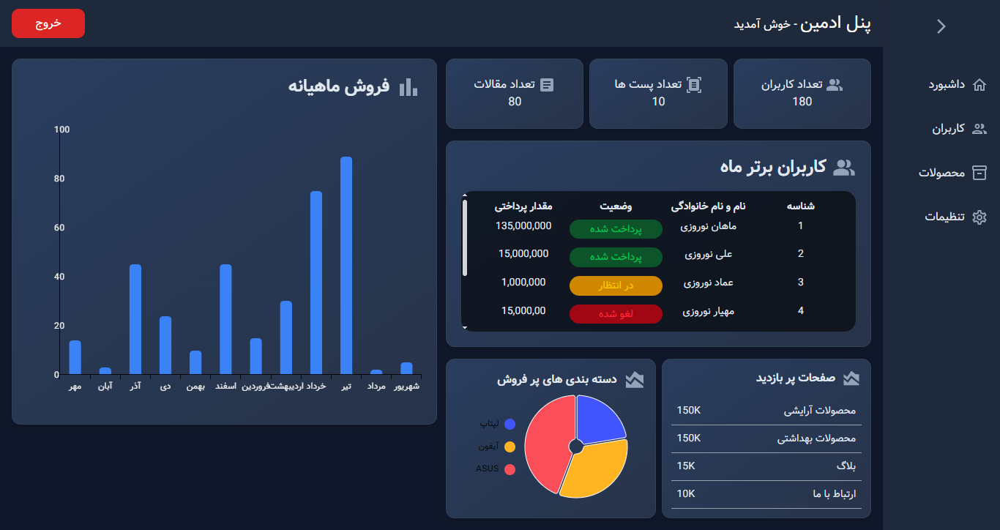
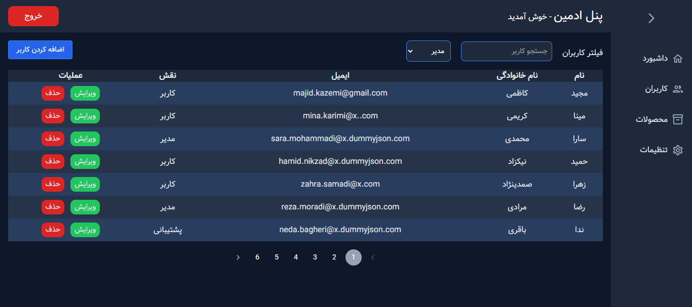

# react-admin-panel
# React + Material Ui + React Router + Tailwind Css
<p align="center">
This is my first official project. A fairly advanced admin panel for managing educational, sales, and other sites
</p>
<p align="center">
  Designed with the latest technologies mentioned below
</p>

# Project details
Dashboard : 



<h2>Feachers :</h2>
<p>General statistics of articles, posts and users</p>
<p>Display site sales statistics and best-selling products</p>
<p>Show high-transaction users</p>
<p>Updating ...</p>

User Panel :


<h2>Feachers :</h2>
<p>CRUD in new update (delete available)</p>
<p>filter user with Name , family and role(in update)</p>
<p>Pagintion feacher</p>
<p>Updating ...</p>

# instalation
instal dependencies
```bash
npm i
```
run json-sever fake backEnd
```bash
npm run server
```
at the last run project
```bash
npm run dev
```

# Technologies 💻
frontEnd :

React

Tailwind Css

Styles-component

Material Ui

React Router

Motion js

Fake BackEnd :
json-server

<h1 align="center">
  Thank you for your comments and suggestions for new features.
</h1>
